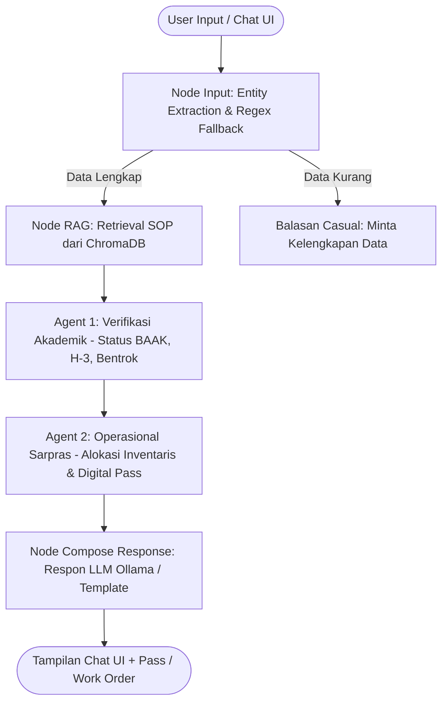

# 🏫 Sistem Peminjaman Ruangan Kampus Multi-Agent (LangGraph)
> **Proyek UAS Data Mining**  
> *Solusi Cerdas Peminjaman Ruangan Kelas Berbasis Multi-Agentic Architecture, RAG, dan Local LLM (Ollama)*

> *👥 Penulis & Pengembang
> 
>      **NIM Nama**: 23.11.5492 Jihan Humaira
>                    23.11.5471 Agustina Septofanny
> 
>      **Mata Kuliah**: Data Mining
> 
>      **Jurusan**: Informatika*

---

## 📌 Gambaran Umum Proyek

Aplikasi web ini adalah solusi enterprise berbasis **Multi-Agentic AI System (LangGraph)** yang dirancang untuk mengotomatisasi seluruh alur peminjaman ruangan kelas di lingkungan kampus Universitas AMIKOM Yogyakarta.

Sistem mengintegrasikan verifikasi kelayakan akademik mahasiswa dari data BAAK, pengecekan bentrok jadwal perkuliahan reguler dan booking insidental, alokasi sarana prasarana, hingga penerbitan **Digital Pass (`KP-XXXXXXXX`)** dan **Work Order (`WO-XXXXXXXX`)**.

---

## ✨ Fitur Utama

- 🤖 **Multi-Agentic Decision Workflow (LangGraph)**: Membagi tugas ke agen-agen terpesialisasi (Verifikasi Akademik, Operasional Sarpras, RAG SOP).
- 💬 **Multi-Turn Conversational Context (`1 Session = 1 Context`)**: Akumulasi entitas secara persisten (`st.session_state["session_context"]`), mendukung pertanyaan *follow-up* (misal: *"kalau jam 15.30 gimana?"*, *"kalau tanggal 2 agustus gimana?"*) tanpa lupa NIM/Ruangan.
- 📆 **Smart Indonesian & Relative Date Parser**: Mengenali secara otomatis kata relatif ("besok", "lusa") dan ekspresi tanggal Indonesia ("2 agustus", "15 agustus 2026") dikonversi ke format ISO `YYYY-MM-DD`.
- 📚 **RAG (Retrieval-Augmented Generation)**: Membaca dokumen SOP resmi (`asset/sop_peminjaman.pdf`) menggunakan ChromaDB & HuggingFace Embeddings (`all-MiniLM-L6-v2`).
- 🎨 **Visual Dashboard Jadwal Kuliah**: Menampilkan jadwal perkuliahan reguler dalam bentuk *Visual Cards* interaktif lengkap dengan paginasi dan filter hari/ruangan.
- 🚫 **Zero Hallucination & Strict Prompting**: Balasan AI disusun secara santai, ramah, dan bebas dari halusinasi link URL / template email kaku.
- 🔄 **Tombol Reset Chat**: Fitur pembersihan sesi sekali klik untuk memulai peminjaman baru.
- 📊 **Automated Quantitative Evaluator**: Script `evaluator.py` otomatis menguji 15 *Test Cases* dengan metrik presisi akurasi, efektivitas, halusinasi, dan latency.

---

## 🏗️ Arsitektur Sistem & Alur Agen

Sistem menggunakan alur grafik terarah (**LangGraph StateGraph**):



---

## 📂 Struktur Direktori Project

```text
UAS_DataMining/
├── app.py                      # Aplikasi Utama Streamlit & LangGraph Multi-Agent
├── evaluator.py                # Script Evaluasi Kuantitatif (15 Test Cases & Reporting)
├── evaluation_report.md        # Laporan Rekapitulasi Hasil Evaluasi Kuantitatif
├── requirements.txt            # Daftar Dependency Library Python
├── .gitignore                  # Berkas Exclude Git
├── README.md                   # Dokumentasi Utama Proyek
└── asset/                      # Folder Berkas Data Pendukung
    ├── daftar_mahasiswa.xlsx   # Master Data Mahasiswa BAAK (NIM, Nama, Status)
    ├── riwayat_peminjaman.xlsx # Log Peminjaman Ruang Insidental
    ├── jadwal_praktikum.xlsx   # Master Jadwal Kuliah Reguler Mingguan
    └── sop_peminjaman.pdf      # Dokumen SOP Resmi Peminjaman Ruang
```

---

## 🚀 Panduan Memulai & Jalankan Proyek

### 1. Prasyarat System
- Python `3.10` atau versi lebih baru
- [Ollama](https://ollama.com/) sudah terinstall di perangkat Anda.

### 2. Clone Repository & Setup Virtual Environment
```bash
git clone https://github.com/USERNAME/UAS_DataMining.git
cd UAS_DataMining

# Buat virtual environment (opsional tapi disarankan)
python -m venv .venv
# Aktivasi di Windows Command Prompt / PowerShell:
.venv\Scripts\activate
```

### 3. Install Dependencies
```bash
pip install -r requirements.txt
```

### 4. Jalankan Service Ollama Lokal
Buka terminal terpisah dan jalankan service Ollama:
```bash
ollama serve
```
Pastikan model `llama3.2` sudah di-pull:
```bash
ollama run llama3.2
```

### 5. Jalankan Aplikasi Streamlit
```bash
streamlit run app.py
```
Buka browser di `http://localhost:8501`.

---

## 📊 Pengujian Evaluator Kuantitatif (`evaluator.py`)

Untuk mengeksekusi pengujian kuantitatif otomatis (15 *Test Cases*), jalankan perintah:

```bash
python evaluator.py
```

### Rekapitulasi Metrik Kinerja Sistem:
| Metrik Evaluasi Kuantitatif | Benchmark Target | Hasil Evaluasi | Status |
|---|---|---|---|
| 🎯 **Decision Accuracy** | ≥ 90.0% | **100.00%** (15/15 Pass) | ✅ **PERFECT** |
| 🔍 **Entity Extraction Accuracy** | ≥ 90.0% | **98.33%** (59/60 Entitas) | ✅ **EXCELLENT** |
| 🚫 **Hallucination Rate** | ≤ 5.0% | **0.00%** | ✅ **ZERO HALU** |
| 📝 **Explainability Index** | 100.0% | **100.00%** | ✅ **TRANSPARENT** |
| ⚡ **Average Latency** | < 10.0s | **8.17 detik** / case | ⚡ **EFEKTIF** |

---
